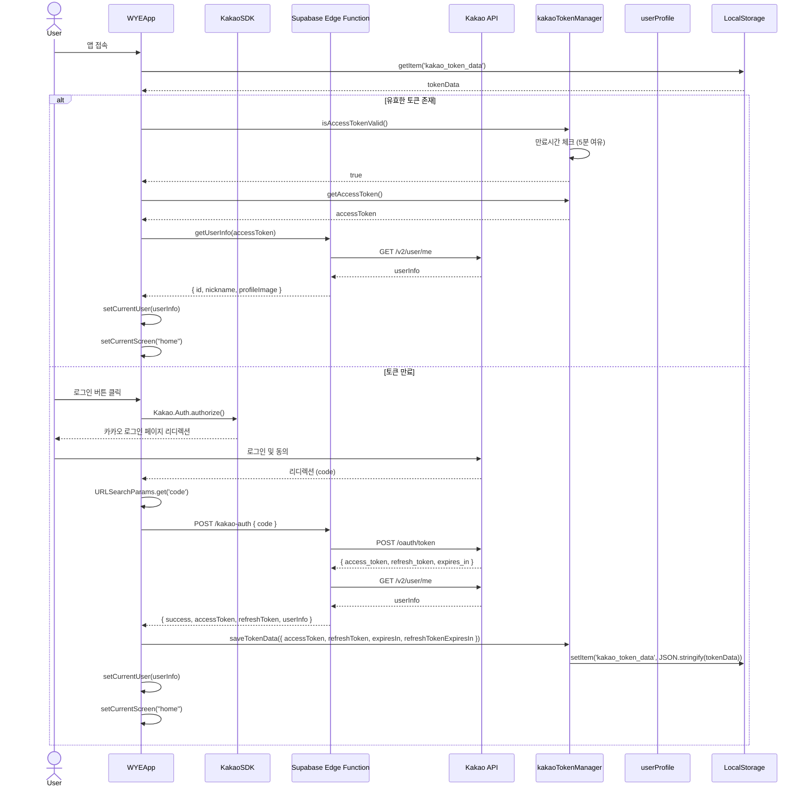
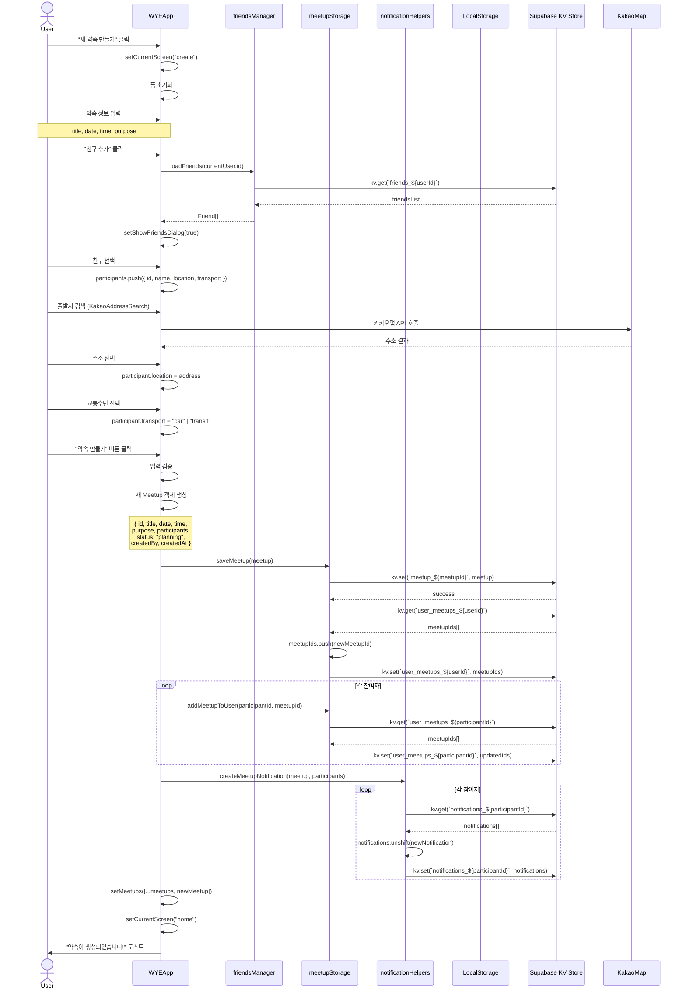
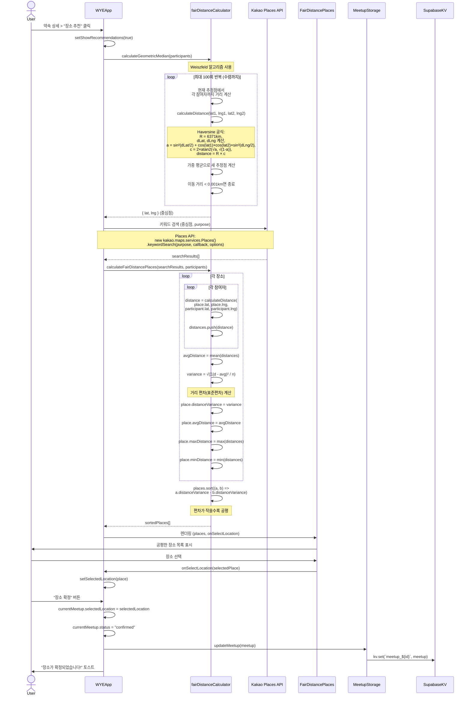
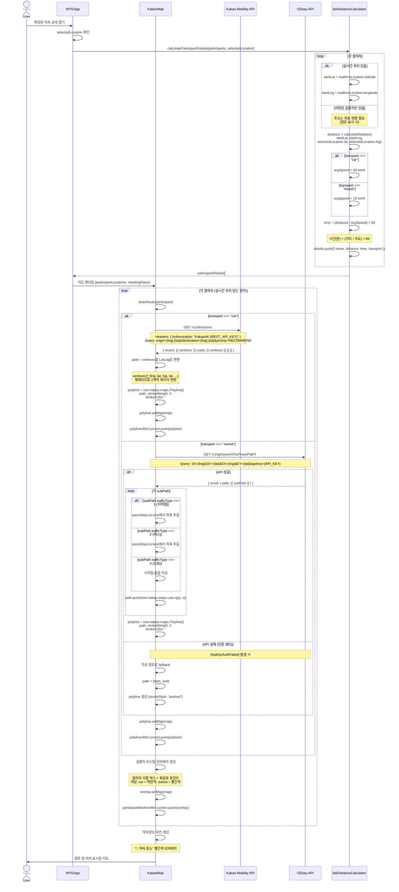
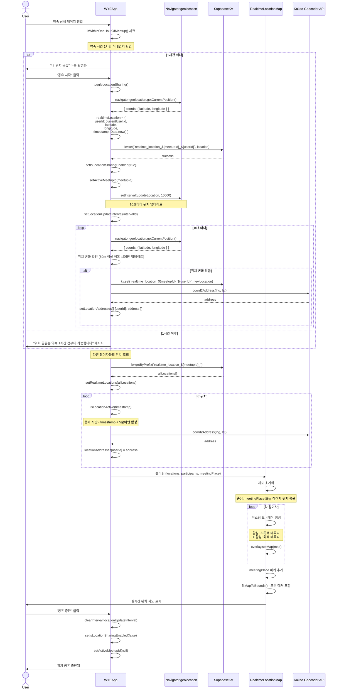
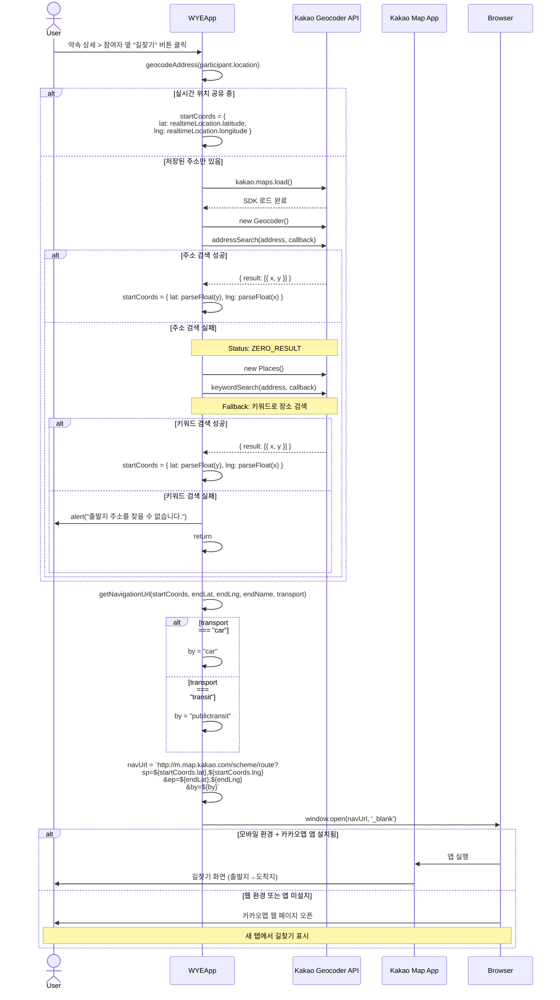
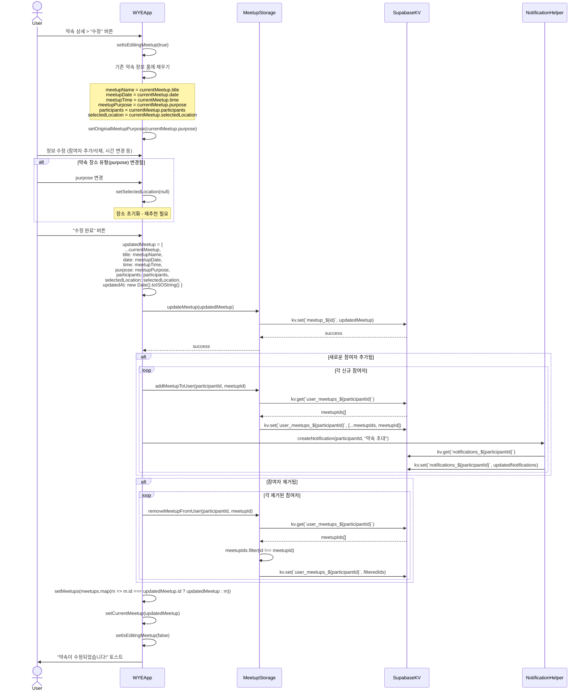

# WYE (Where You @) - 시퀀스 다이어그램

## 1. 카카오 로그인 흐름



## 2. 약속 생성 흐름



## 3. 공평 거리 장소 추천 흐름



## 4. 경로 표시 및 이동시간 계산 흐름



## 5. 실시간 위치 공유 흐름



## 6. 길찾기 흐름



## 7. 약속 수정 흐름



## 8. 데이터 구조 및 저장소 관계

```mermaid
classDiagram
    class WYEApp {
        -User currentUser
        -Meetup[] meetups
        -Participant[] participants
        -Location selectedLocation
        -RealtimeLocation[] realtimeLocations
        -Notification[] notifications
        -string currentScreen
        -boolean isLocationSharingEnabled
        +handleLogin()
        +createMeetup()
        +updateMeetup()
        +deleteMeetup()
        +toggleLocationSharing()
        +geocodeAddress(address)
        +getNavigationUrl()
    }
    
    class User {
        +string id
        +string name
        +string email
        +string profileImage
    }
    
    class Meetup {
        +string id
        +string title
        +string date
        +string time
        +string purpose
        +Participant[] participants
        +Location selectedLocation
        +string status
        +string createdBy
        +string[] items
        +string createdAt
        +string updatedAt
    }
    
    class Participant {
        +string id
        +string name
        +string location
        +string transport
    }
    
    class Location {
        +string name
        +string address
        +number lat
        +number lng
        +number rating
        +string distance
        +string type
        +number distanceVariance
        +number avgDistance
    }
    
    class RealtimeLocation {
        +string userId
        +number latitude
        +number longitude
        +number timestamp
    }
    
    class Notification {
        +string id
        +string type
        +string message
        +string timestamp
        +boolean read
        +string meetupId
        +string meetupTitle
    }
    
    class kakaoTokenManager {
        +saveTokenData(data)
        +getTokenData()
        +isAccessTokenValid()
        +getAccessToken()
        +refreshAccessToken()
        +clearTokenData()
    }
    
    class meetupStorage {
        +saveMeetup(meetup)
        +getMeetup(id)
        +updateMeetup(meetup)
        +deleteMeetup(id)
        +getUserMeetups(userId)
        +addMeetupToUser(userId, meetupId)
    }
    
    class fairDistanceCalculator {
        +calculateDistance(lat1, lng1, lat2, lng2)
        +calculateGeometricMedian(participants)
        +calculateFairDistancePlaces(places, participants)
        +calculateParticipantDetails(participants, selectedLocation)
    }
    
    class friendsManager {
        +loadFriends(userId)
        +saveFriends(userId, friends)
        +addFriend(userId, friend)
        +removeFriend(userId, friendId)
    }
    
    class userProfile {
        +saveProfile(userId, profile)
        +getProfile(userId)
        +updateProfile(userId, updates)
    }
    
    class KakaoMap {
        -any mapInstance
        -any[] polylinesRef
        -any[] participantMarkersRef
        +drawRoute(participant)
        +addMeetingPlaceMarker()
        +fitMapToBounds()
    }
    
    class RealtimeLocationMap {
        -any mapInstance
        -any[] overlaysRef
        +addMeetingPlaceMarker()
        +fitMapToBounds()
    }
    
    class SupabaseKV {
        +get(key)
        +set(key, value)
        +getByPrefix(prefix)
        +mget(keys)
        +mset(entries)
        +del(key)
    }
    
    WYEApp --> User
    WYEApp --> Meetup
    WYEApp --> RealtimeLocation
    WYEApp --> Notification
    Meetup --> Participant
    Meetup --> Location
    
    WYEApp ..> kakaoTokenManager : uses
    WYEApp ..> meetupStorage : uses
    WYEApp ..> fairDistanceCalculator : uses
    WYEApp ..> friendsManager : uses
    WYEApp ..> userProfile : uses
    WYEApp --> KakaoMap : renders
    WYEApp --> RealtimeLocationMap : renders
    
    kakaoTokenManager ..> SupabaseKV : stores in localStorage
    meetupStorage ..> SupabaseKV : uses
    friendsManager ..> SupabaseKV : uses
    userProfile ..> SupabaseKV : uses
```



## 9. 주요 알고리즘 및 계산식

### 9.1 Haversine 거리 계산
```
R = 6371 (지구 반지름 km)
dLat = (lat2 - lat1) × π / 180
dLng = (lng2 - lng1) × π / 180

a = sin²(dLat/2) + cos(lat1 × π/180) × cos(lat2 × π/180) × sin²(dLng/2)
c = 2 × atan2(√a, √(1-a))
distance = R × c
```

### 9.2 Geometric Median (Weiszfeld 알고리즘)
```
초기값: centerLat = 평균위도, centerLng = 평균경도

반복 (최대 100회):
  totalWeight = 0
  newLat = 0
  newLng = 0
  
  각 참여자 p:
    d = calculateDistance(centerLat, centerLng, p.lat, p.lng)
    만약 d > 0:
      weight = 1 / d
      totalWeight += weight
      newLat += p.lat × weight
      newLng += p.lng × weight
  
  newLat /= totalWeight
  newLng /= totalWeight
  
  이동거리 = calculateDistance(centerLat, centerLng, newLat, newLng)
  만약 이동거리 < 0.001: 종료
  
  centerLat = newLat
  centerLng = newLng

반환: { lat: centerLat, lng: centerLng }
```

### 9.3 거리 편차 계산 (공평도)
```
각 장소 place:
  distances = []
  
  각 참여자 p:
    d = calculateDistance(place.lat, place.lng, p.lat, p.lng)
    distances.push(d)
  
  avgDistance = sum(distances) / distances.length
  
  variance = √(Σ(d - avgDistance)² / distances.length)
  
  place.distanceVariance = variance
  place.avgDistance = avgDistance

정렬: places.sort((a, b) => a.distanceVariance - b.distanceVariance)
```

### 9.4 이동 시간 추정
```
만약 transport === "car":
  avgSpeed = 40 km/h
아니면:
  avgSpeed = 25 km/h

time (분) = (distance / avgSpeed) × 60
```

## 10. 외부 API 호출 정리

### 10.1 Kakao Mobility API (자동차 경로)
```
GET https://apis-navi.kakaomobility.com/v1/directions
Headers:
  Authorization: KakaoAK {REST_API_KEY}
Query:
  origin={startLng},{startLat}
  destination={endLng},{endLat}
  priority=RECOMMEND

Response:
  routes[0].sections[0].roads[].vertexes (경로 좌표 배열)
```

### 10.2 ODsay API (대중교통 경로)
```
GET https://api.odsay.com/v1/api/searchPubTransPathT
Query:
  SX={startLng}
  SY={startLat}
  EX={endLng}
  EY={endLat}
  apiKey={API_KEY} (URL encoded)

Response:
  result.path[0].subPath[] (구간별 경로 정보)
  - trafficType: 1(지하철), 2(버스), 3(도보)
  - passStopList.lane[] (경유 정류장 좌표)
```

### 10.3 Kakao Places API (장소 검색)
```
JavaScript SDK:
  places = new kakao.maps.services.Places()
  places.keywordSearch(keyword, callback, {
    location: new kakao.maps.LatLng(centerLat, centerLng),
    radius: 3000
  })

Response:
  결과 배열 [{
    place_name,
    address_name,
    x (경도),
    y (위도),
    phone,
    category_name
  }]
```

### 10.4 Kakao Geocoder API (주소→좌표)
```
JavaScript SDK:
  geocoder = new kakao.maps.services.Geocoder()
  geocoder.addressSearch(address, callback)

Fallback (키워드 검색):
  places = new kakao.maps.services.Places()
  places.keywordSearch(address, callback)

Response:
  result[0] { x (경도), y (위도) }
```

### 10.5 Kakao Coord2Address API (좌표→주소)
```
JavaScript SDK:
  geocoder = new kakao.maps.services.Geocoder()
  geocoder.coord2Address(lng, lat, callback)

Response:
  address.address_name (지번 주소)
  또는 road_address.address_name (도로명 주소)
```

## 11. 저장소 키 구조 (Supabase KV)

```
토큰:
  - kakao_token_data (localStorage)

사용자:
  - user_profile_{userId}
  - user_meetups_{userId} (약속 ID 배열)
  - friends_{userId} (친구 목록)
  - crews_{userId} (크루 목록)

약속:
  - meetup_{meetupId}
  - realtime_location_{meetupId}_{userId}

알림:
  - notifications_{userId}

설정:
  - lateCheckedMeetups (Set<meetupId>) (localStorage)
  - unreadMeetups (Set<meetupId>) (localStorage)
```
