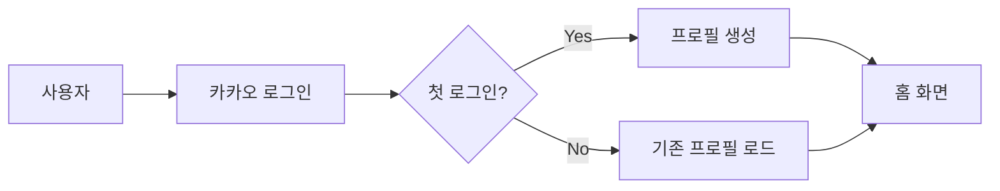
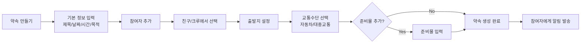
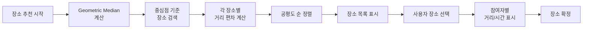
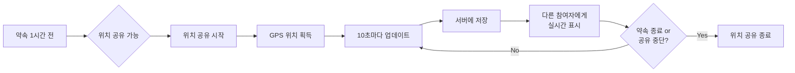
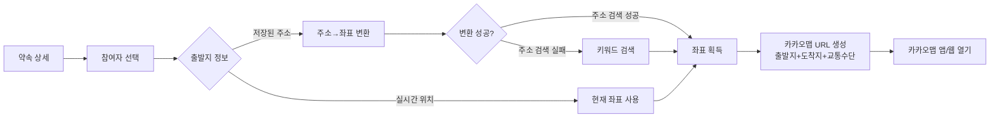
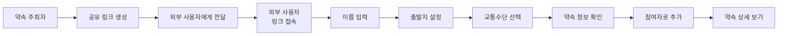

# WYE (Where You @) - 유즈케이스 다이어그램

## 전체 유즈케이스 다이어그램

```mermaid
graph TB
    %% 액터
    User([회원 사용자])
    ExternalUser([외부 사용자])
    
    %% 인증
    Login[로그인]
    Logout[로그아웃]
    
    %% 프로필 및 관계
    Profile[프로필 관리]
    Friends[친구 관리]
    Crews[크루 관리]
    
    %% 약속
    CreateMeetup[약속 만들기]
    ManageMeetup[약속 관리]
    ShareMeetup[약속 공유]
    
    %% 장소
    RecommendPlace[공평 거리<br/>장소 추천]
    SelectPlace[장소 선택 및 확정]
    
    %% 실시간
    ShareLocation[실시간 위치 공유<br/>약속 1시간 전]
    ViewRealtimeMap[실시간 지도 보기]
    
    %% 경로
    ViewRoute[경로 보기]
    Navigate[길찾기]
    
    %% 알림
    Notifications[알림 확인]
    
    %% 준비물
    ManageItems[준비물 관리]
    
    %% 외부 사용자
    JoinViaLink[공유 링크로<br/>약속 참여]
    
    %% 연결: 회원 사용자
    User --> Login
    User --> Logout
    User --> Profile
    User --> Friends
    User --> Crews
    User --> CreateMeetup
    User --> ManageMeetup
    User --> ShareMeetup
    User --> RecommendPlace
    User --> SelectPlace
    User --> ShareLocation
    User --> ViewRealtimeMap
    User --> ViewRoute
    User --> Navigate
    User --> Notifications
    User --> ManageItems
    
    %% 연결: 외부 사용자
    ExternalUser --> JoinViaLink
    
    %% Include 관계
    CreateMeetup -.->|include| Friends
    CreateMeetup -.->|include| Crews
    RecommendPlace -.->|include| SelectPlace
    ViewRoute -.->|include| ViewRealtimeMap
    
    style User fill:#e3f2fd
    style ExternalUser fill:#fff3e0
    style Login fill:#c8e6c9
    style CreateMeetup fill:#fff9c4
    style RecommendPlace fill:#ffccbc
    style ShareLocation fill:#b2ebf2
    style Navigate fill:#e0e0e0
```

## 주요 유즈케이스 흐름

### 1. 회원 가입 및 로그인

### 2. 약속 생성 흐름

### 3. 공평 거리 장소 추천 흐름

### 4. 실시간 위치 공유 흐름

### 5. 길찾기 흐름

### 6. 외부 사용자 참여 흐름

## 액터별 주요 기능 정리

### 회원 사용자
- **계정 관리**: 로그인, 로그아웃, 프로필 수정
- **관계 관리**: 친구 추가/수정/삭제, 크루 생성/수정/삭제
- **약속 관리**: 생성, 수정, 삭제, 정렬, 공유
- **장소 선택**: 공평 거리 추천, 검색, 선택, 확정
- **실시간 기능**: 위치 공유, 실시간 지도, 길찾기
- **알림**: 초대, 수정, 지각 알림 수신
- **준비물**: 추가, 보기, 삭제

### 외부 사용자 (비회원)
- **참여**: 공유 링크로 약속 접속
- **정보 입력**: 이름, 출발지, 교통수단
- **조회**: 약속 정보 확인

## 시스템 경계

### 내부 시스템
- WYE 웹 애플리케이션
- Supabase KV 저장소
- Supabase Edge Functions

### 외부 시스템
- Kakao API (로그인, 지도, 장소 검색, Geocoding)
- Kakao Mobility API (자동차 경로)
- ODsay API (대중교통 경로)
- Browser Geolocation API (위치 정보)

## 비기능적 요구사항

### 성능
- 위치 공유: 10초마다 업데이트
- 토큰 갱신: 만료 5분 전 자동 갱신
- 지도 로딩: 3초 이내

### 보안
- 카카오 OAuth 2.0 인증
- Access Token + Refresh Token 관리
- 위치 정보는 약속 1시간 전부터만 공유

### 사용성
- 모바일 최적화 UI
- 실시간 알림
- 직관적인 장소 추천

### 호환성
- 웹 브라우저 (Chrome, Safari, Edge)
- 카카오맵 앱 연동
- GPS 지원 디바이스
